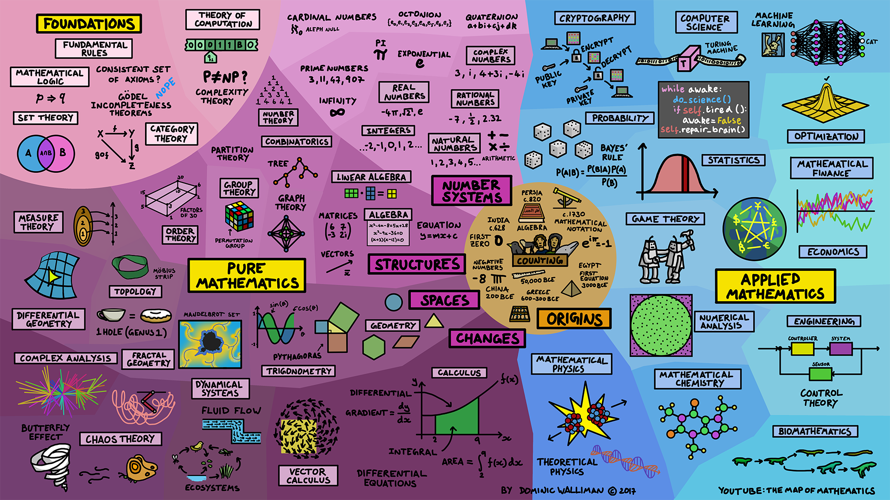

# Math Fundamentals

* The concept of a set
* Relations
* Inclusion-exclusion principle
* Introduction to statements of logic
* Set algebra
* Permutations and Combinations
* Probability concepts
* Probability Distribution: Introduction
* Probability Distributions: Random variables

---

REF: [The map of mathematics](https://www.youtube.com/watch?v=OmJ-4B-mS-Y)
